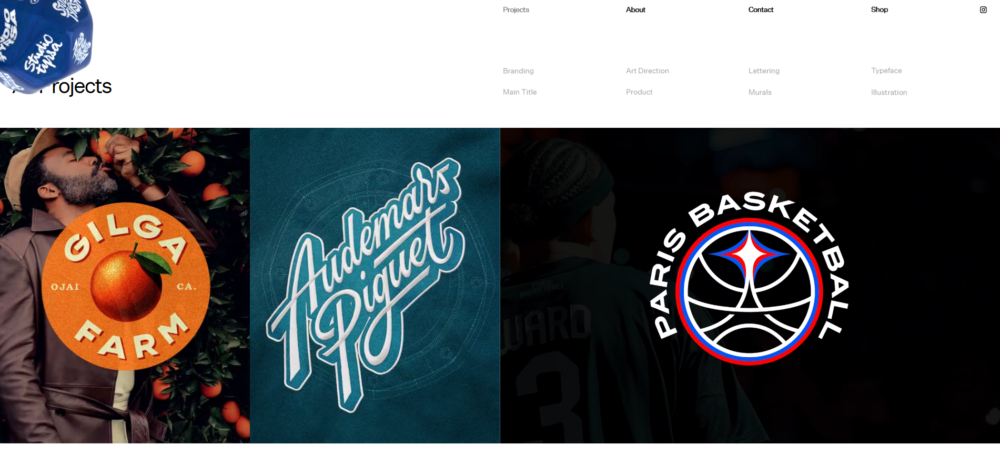
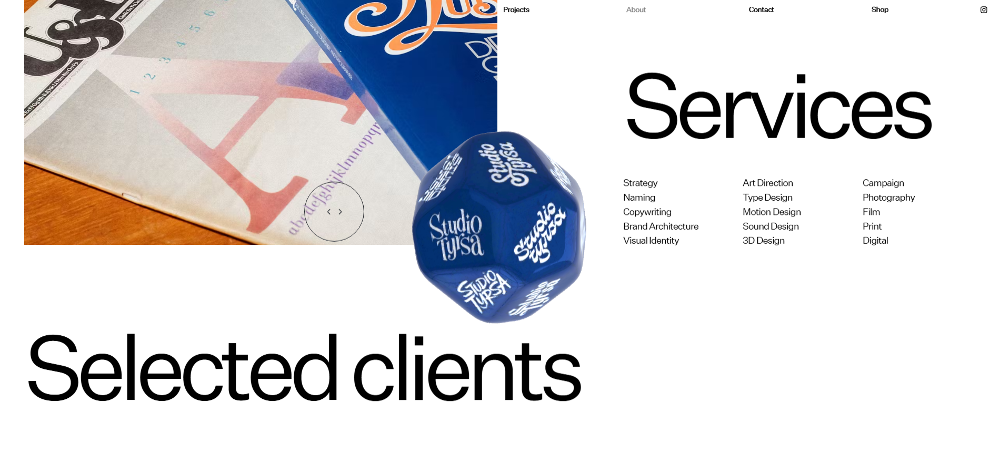

# Trabajo-final

### ¿Para qué es esta propuesta?
##### Esta propuesta tiene como proposito ser el medio por el cual se expondrían mis trabajos ya anteriormente realizados de forma clara y profesional, dandole así la relevancia y claridad para entender las especificaciones y temas que abordó cada trabajo individual, por lo que esta propuesta sería un portafolio de diseño, que a la vez refleje mis intereses y gustos.

### ¿Para quiénes es esta propuesta?

### Usuarios menos probables:

#### Usuario 1 - extremo
#### Valentina Torres - 34 años

##### Demografía: Es coordinadora de Comunicación e Innovación de un centro de innovación, trabaja constantemente en entornos colaborativos y usa redes como LinkedIn, Behance y busca paginas web para descubrir nuevos talentos.

##### Comportamientos y creencias: Cree firmemente que la creatividad y la tecnología deben unirse para generar impacto social, constantemente busca colaboradores con pensamiento estratégico y visual potente, le gusta ver exploración material, prototipos, maquetas o procesos fuera del mundo digital, pero no deja de lado lo que es visualmente atractivo pues sabe que los objetos deben venderse además de ser funcionales.

##### Necesidades y objetivos: Necesita encontrar diseñadores que puedan traducir ideas abstractas en experiencias visuales que tengan una mirada fresca dentro del área y busca perfiles creativos con sensibilidad conceptual y capacidad de comunicación visual clara.

### Usuario 2 - extremo
#### Rodrigo Álvarez - 46 años

##### Demografía: Es gerente de marketing de una empresa del rubro financiero, encargado tambien de reclutar a nuevas personas para la empresa y busca los busca por LinkedIn o recomendaciones.

##### Comportamientos y creencias: Es un fiel creyente de que la marca es una herramienta clave para generar confianza y prestigio, por lo cual le da especial atención a los detalles en ese sentido, Prefiere resultados digitales, orden y claridad en la comunicación visual y valora la coherencia estética y el profesionalismo

##### Necesidades y objetivos: Le gustan los portafolios "situados" ya que le gusta ver ejemplos de la vida real, y necesita un diseñador que traduzca los valores corporativos en identidad visual sólida, busca consistencia y capacidad de adaptación a distintos formatos ya sea digitales o análogos.

### Usuario 3 - Promedio
#### Camila Paredes - 29 años

##### Demografía: Es diseñadora gráfica con especialización en branding y directora de arte de una agencia de diseño y branding.

##### Comportamientos y creencias: Cree que un buen diseñador comunica tanto con estética como con propósito, le da importancia a la conceptualización dentras de la marca y toda la toma de decisiones hasta el resultado final, por lo que tambipen valora el uso de referentes y antecedentes en cada entregable.

##### Necesidades y objetivos: Necesita identificar diseñadores que puedan integrarse en equipos multidisciplinarios, manejando tanto habilidades blandas como habilidades duras en un entorno de trabajo, además busca creatividad, criterio visual y manejo técnico de herramientas básicas para cualquier diseño (no discrimina la herramienta que el diseñador use).

### Antecedentes

##### 1. Studio Tyrsa

##### Es un portafolio, donde hay  una galeria de imágenes que muestra cada proyecto, adememás de estar separada por secciones, donde los proyectos, la descripción, cpntacto, etc. están por separado.

#### Fuente
<https://www.studiotyrsa.com/>

| Aspectos positivos | Aspectos negativos |
| ---------------- | ---------------- |
| Es intuitiva y dinámica, llama facilmente la atención del usuario, me gusta como están puestos los titulos    | Para mi gusto tiene demasiados efectos, a veces carga muy lento las fotos y el dado que existe dentro de la página a veces siento que estorba un poco    |

##### 2...

##### Es...
#### Fuente
<.../>

| Aspectos positivos | Aspectos negativos |
| ---------------- | ---------------- |
| Es...     | Para...    |

##### 3...

##### Es...
#### Fuente
<.../>

| Aspectos positivos | Aspectos negativos |
| ---------------- | ---------------- |
| Es...     | Para...    |

##### 4...

##### Es...
#### Fuente
<.../>

| Aspectos positivos | Aspectos negativos |
| ---------------- | ---------------- |
| Es...     | Para...    |

##### 5...

##### Es...
#### Fuente
<.../>

| Aspectos positivos | Aspectos negativos |
| ---------------- | ---------------- |
| Es...     | Para...    |

##### 6...

##### Es...
#### Fuente
<.../>

| Aspectos positivos | Aspectos negativos |
| ---------------- | ---------------- |
| Es...     | Para...    |

### Referentes

